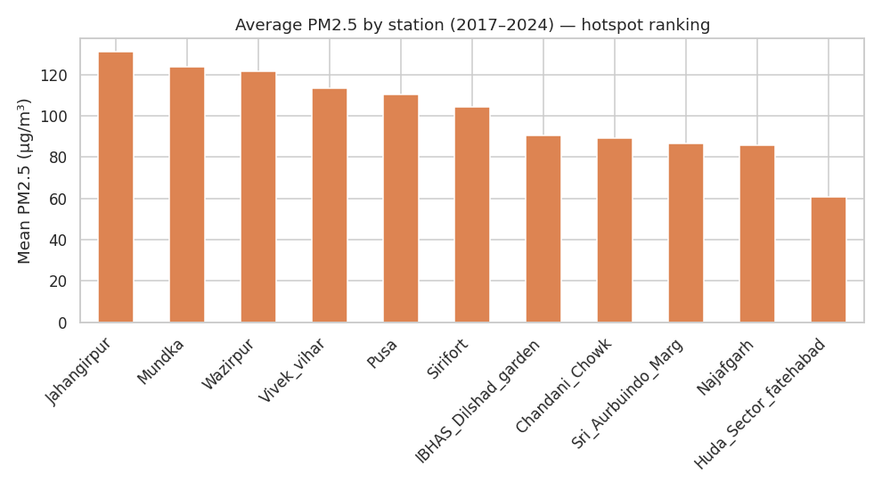
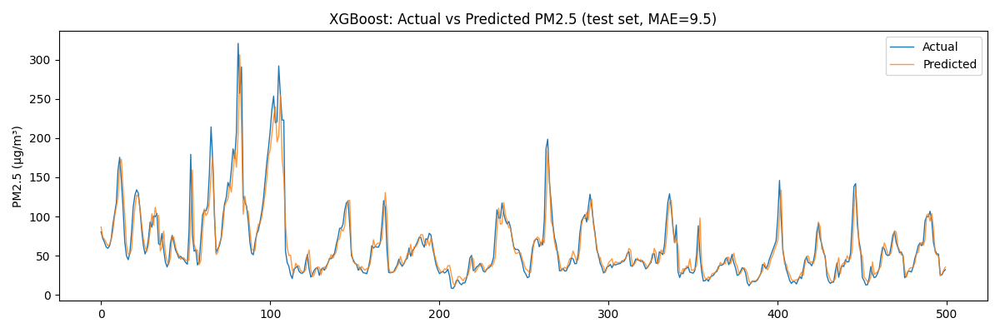
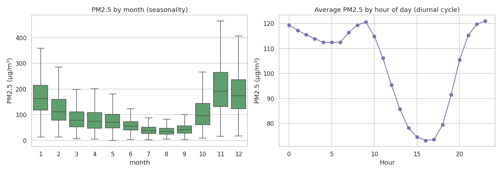

# Air Quality Prediction and Forecasting — Delhi NCR

Scalable forecasting system integrating CPCB sensor data and meteorological
variables to predict PM2.5 and identify pollution hotspots across 11 Delhi
monitoring stations.

## Objective
Build a scalable forecasting system integrating CPCB sensors and
meteorological datasets to predict air pollution levels and surface
pollution hotspots.

## Data
Hourly CPCB sensor readings (2017–2024, 70,128 timestamps) from 11 Delhi
stations: Pusa, IBHAS Dilshad Garden, Sirifort, Jahangirpur, Najafgarh,
Wazirpur, Vivek Vihar, Mundka, Sri Aurobindo Marg, Chandni Chowk, and Huda
Sector Fatehabad. Each station reports 24 variables: PM2.5, PM10, NO, NO2,
NOx, NH3, SO2, CO, Ozone, BTX compounds, and meteorological data (temperature,
relative humidity, wind speed/direction, rainfall, solar radiation, pressure).

> **On data files in this repo:** neither the raw Excel export (~96 MB) nor
> the full cleaned dataset (`data/aq_wide.parquet`, 70,128 hourly rows,
> 2017–2024 — this is what the models below were actually trained on) is
> committed to git, since both are too large/heavy for a code repo.
> `data/aq_sample.csv` is only the **last 30 days** (721 rows) of the
> cleaned data, included purely as a quick-look preview of the schema.
>
> To regenerate the full cleaned dataset yourself, run:
> ```bash
> python src/etl.py --input path/to/your/raw_stations_export.xlsx --outdir data
> ```
> This recreates `data/aq_wide.parquet` locally, which `notebooks/01_eda.ipynb`,
> `src/train_xgboost.py`, `src/train_lstm.py`, and `app/dashboard.py` all
> read from.

## Approach

1. **ETL** (`src/etl.py`) — parses the raw multi-station Excel export,
   handles `NA` sentinel values, and reshapes 265 raw columns into a clean
   wide table (`data/aq_wide.parquet`, one row per hour, one column per
   station-pollutant pair).
2. **EDA** (`notebooks/01_eda.ipynb`) — missing-data profiling, PM2.5 trend
   analysis (seasonal + diurnal), station comparison, and pollutant-weather
   correlation.
3. **Feature engineering** (`src/features.py`) — lag features (1h, 3h, 6h,
   24h), rolling mean/std, cyclic hour/month encodings, day-of-week, cross-
   pollutant lags, and station one-hot encoding — spatio-temporal features
   feeding both models.
4. **Modelling**:
   - `src/train_xgboost.py` — gradient-boosted regressor forecasting
     next-hour PM2.5 across all stations.
   - `src/train_lstm.py` — sequence model (2-layer LSTM) forecasting
     next-hour PM2.5 from a 24-hour sliding window, for the Pusa station.
5. **Prototype** (`app/dashboard.py`) — Streamlit dashboard that loads the
   trained XGBoost model, forecasts next-hour PM2.5 for every station, maps
   them, and flags hotspots crossing the "Very Poor" AQI band.

## Results

| Model    | Scope             | MAE (µg/m³) | RMSE (µg/m³) | R²    |
|----------|-------------------|-------------|--------------|-------|
| XGBoost  | All 11 stations   | 9.5         | 16.8         | 0.960 |
| LSTM     | Pusa station only | 18.1        | 30.4         | 0.878 |

XGBoost outperforms the single-station LSTM here, largely because it can
pool feature information (lags, weather, cross-pollutant signals) across
all stations at once; the LSTM uses only the PM2.5 sequence itself. See
`notebooks/01_eda.ipynb` and `outputs/figures/` for full plots.

### Sample figures

**Pollution hotspot ranking (avg PM2.5 by station, 2017–2024):**


**XGBoost: predicted vs actual PM2.5 (test set):**


**PM2.5 seasonality and diurnal pattern:**


## Repo structure
```
├── data/                # aq_wide.parquet (generated), aq_sample.csv
├── notebooks/
│   └── 01_eda.ipynb     # exploratory data analysis
├── src/
│   ├── etl.py           # raw Excel -> clean parquet
│   ├── features.py      # feature engineering
│   ├── train_xgboost.py
│   └── train_lstm.py
├── models/              # saved model artifacts
├── outputs/             # metrics (json) + figures (png)
└── app/
    └── dashboard.py     # Streamlit hotspot dashboard
```

## Setup & usage

```bash
pip install -r requirements.txt

# 1. Regenerate the cleaned dataset from the raw Excel export
python src/etl.py --input path/to/raw.xlsx --outdir data

# 2. Explore the data
jupyter notebook notebooks/01_eda.ipynb

# 3. Train models
cd src
python train_xgboost.py
python train_lstm.py

# 4. Run the prototype dashboard
cd ..
streamlit run app/dashboard.py
```

## Notes on scope
This is a research prototype: models are trained on a single random-free,
time-ordered train/test split rather than full walk-forward cross-validation,
and the LSTM is demonstrated on one representative station rather than all
eleven. Both are natural next steps, along with incorporating satellite AOD
data as referenced in the original project scope.
